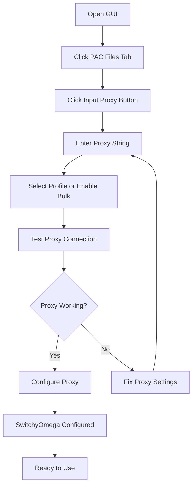

# 🌐 Proxy Input Guide

## 📋 **Tổng quan**

Hệ thống proxy input cho phép bạn cấu hình proxy cho Chrome profiles một cách dễ dàng thông qua giao diện người dùng.

## 🚀 **Cách sử dụng**

### **1. Mở Proxy Input Dialog**

1. **Khởi động GUI**: `python gui_manager_modern.py`
2. **Click tab "📁 PAC Files"**
3. **Click button "🔧 Input Proxy"**

### **2. Định dạng Proxy String**

```
Format: server:port:username:password
```

**Ví dụ:**
- `146.19.196.16:40742:dNMWW2VVxb:YySfhZZPYv`
- `192.168.1.1:8080`
- `proxy.example.com:3128:user:pass`

### **3. Cấu hình Proxy**

#### **Single Profile:**
1. Nhập proxy string vào ô "Proxy String"
2. Chọn profile từ dropdown "Select Profile"
3. Click "🧪 Test Proxy" để kiểm tra kết nối
4. Click "⚙️ Configure" để áp dụng

#### **Bulk Configuration:**
1. Nhập proxy string vào ô "Proxy String"
2. Tick checkbox "Apply to ALL profiles"
3. Click "🧪 Test Proxy" để kiểm tra kết nối
4. Click "⚙️ Configure" để áp dụng cho tất cả profiles

## 🔧 **Tính năng**

### **✅ Proxy String Parsing**
- Tự động parse định dạng `server:port:username:password`
- Hỗ trợ proxy không có authentication
- Validation input format

### **✅ Proxy Testing**
- Test kết nối proxy trước khi áp dụng
- Hiển thị IP address khi proxy hoạt động
- Error handling cho proxy không hoạt động

### **✅ Single & Bulk Configuration**
- Cấu hình cho 1 profile cụ thể
- Cấu hình cho tất cả profiles cùng lúc
- Progress tracking cho bulk operations

### **✅ SwitchyOmega Integration**
- Tự động cấu hình SwitchyOmega extension
- Tạo proxy profile trong SwitchyOmega
- Apply proxy settings cho tất cả protocols

## 📊 **Workflow**



## 🎯 **Ví dụ thực tế**

### **Cấu hình proxy cho profile "76h":**

1. **Proxy String**: `146.19.196.16:40742:dNMWW2VVxb:YySfhZZPYv`
2. **Profile**: `76h`
3. **Test**: ✅ Proxy working! Your IP: 146.19.196.16
4. **Configure**: ✅ Successfully configured proxy for 76h

### **Cấu hình proxy cho tất cả profiles:**

1. **Proxy String**: `192.168.1.1:8080`
2. **Bulk**: ✅ Apply to ALL profiles
3. **Test**: ✅ Proxy working! Your IP: 192.168.1.1
4. **Configure**: ✅ Successfully configured 18/18 profiles

## 🔍 **Troubleshooting**

### **❌ "Invalid proxy format"**
- Kiểm tra định dạng: `server:port:username:password`
- Đảm bảo có ít nhất `server:port`

### **❌ "Cannot connect to proxy"**
- Kiểm tra proxy server có hoạt động không
- Kiểm tra port có đúng không
- Kiểm tra firewall/network

### **❌ "SwitchyOmega configuration failed"**
- Đảm bảo extension SwitchyOmega đã được cài đặt
- Kiểm tra Chrome profile có tồn tại không
- Restart Chrome và thử lại

## 💡 **Tips**

1. **Test proxy trước khi configure** để tránh lãng phí thời gian
2. **Sử dụng bulk configuration** cho nhiều profiles cùng lúc
3. **Kiểm tra SwitchyOmega** sau khi configure để đảm bảo proxy hoạt động
4. **Backup profiles** trước khi thay đổi cấu hình lớn

## 🎉 **Kết quả**

Sau khi cấu hình thành công:

1. **Chrome profile** sẽ có proxy settings
2. **SwitchyOmega extension** sẽ có proxy profile mới
3. **Tất cả traffic** sẽ đi qua proxy server
4. **IP address** sẽ thay đổi theo proxy

---

**🚀 Happy Proxying!** 🌐
